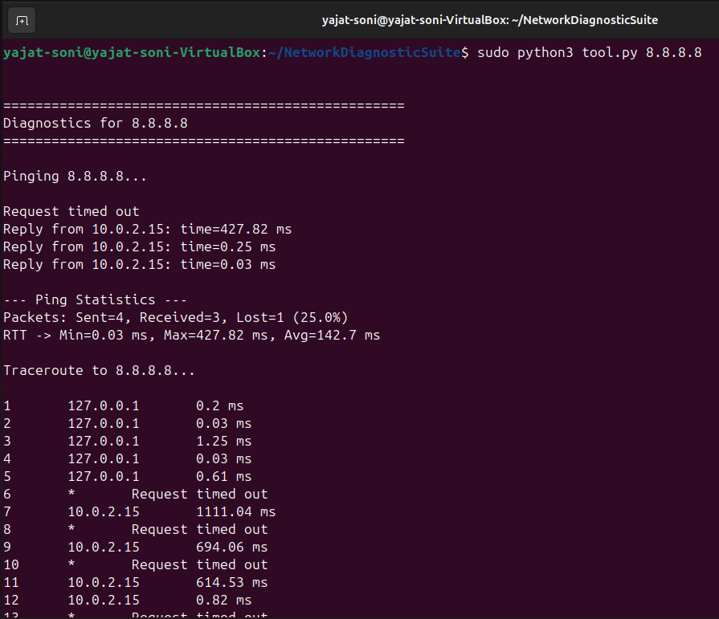
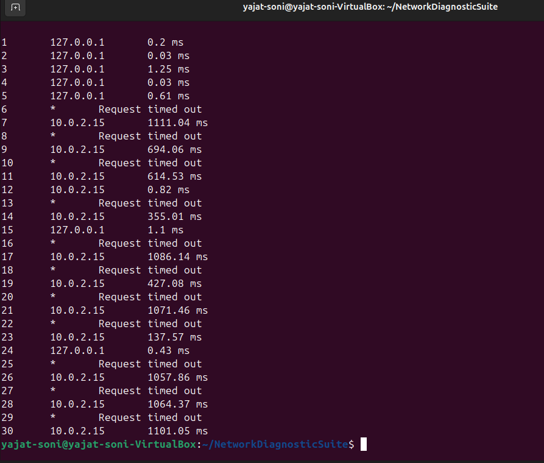

# ICMP-Based Network Diagnostic Suite 🚀

A Python-based network diagnostic tool that combines **Ping** and **Traceroute** functionalities using low-level socket programming and ICMP packets.

---

## 📌 Overview

This project implements a network diagnostic suite using the **Internet Control Message Protocol (ICMP)**. It provides insights into network performance by measuring latency, detecting packet loss, and tracing the path packets take across a network.

Unlike traditional tools, this project uses **raw sockets**, allowing direct interaction with network packets and demonstrating low-level protocol understanding.

---

## ✨ Features

- ✅ ICMP-based Ping implementation  
- ✅ RTT (Round Trip Time) measurement  
- ✅ Packet loss calculation  
- ✅ TTL-based Traceroute  
- ✅ Multi-destination support  
- ✅ Low-level raw socket programming  

---

## 🛠️ Technologies Used

- **Python 3**
- **Socket Programming**
- **ICMP Protocol**
- **Linux / WSL Environment**

---

## ⚙️ How It Works





### 🔹 Ping
- Sends ICMP Echo Request packets  
- Receives ICMP Echo Reply packets  
- Calculates:
  - RTT
  - Packet loss
  - Min/Max/Average latency  

### 🔹 Traceroute
- Sends packets with increasing **TTL (Time-To-Live)** values  
- Each router decrements TTL by 1  
- When TTL reaches 0, router sends **ICMP Time Exceeded** message  
- This reveals each hop between source and destination  

---

## ▶️ How to Run

### ⚠️ Prerequisites
- Linux / WSL (recommended)
- Python 3 installed
- Root privileges (required for raw sockets)

---

### 🧪 Run the Program

```bash
sudo python3 tool.py google.com